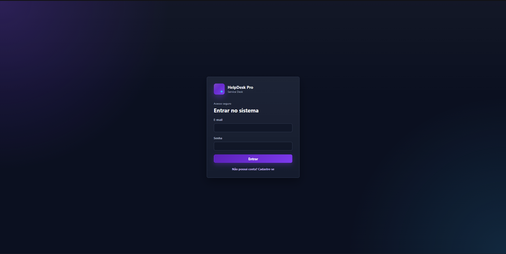
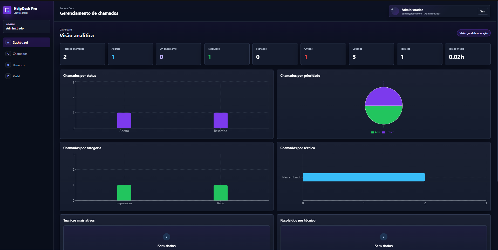
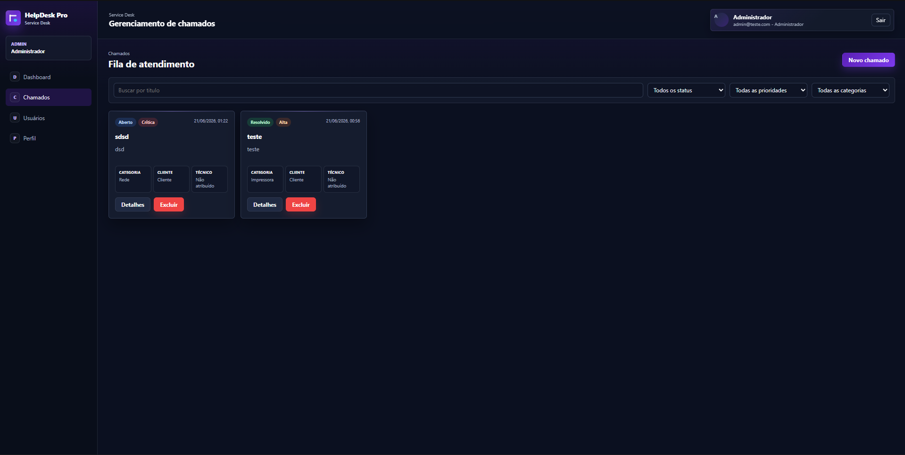
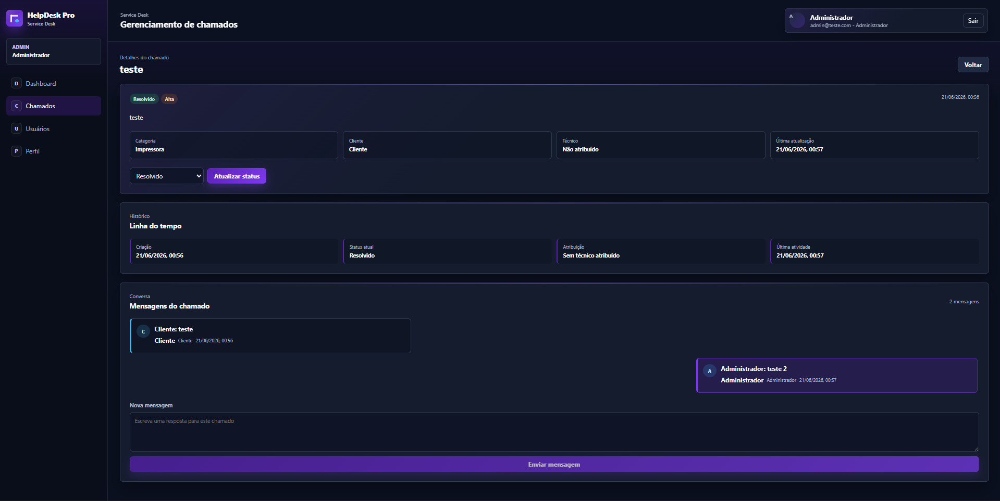
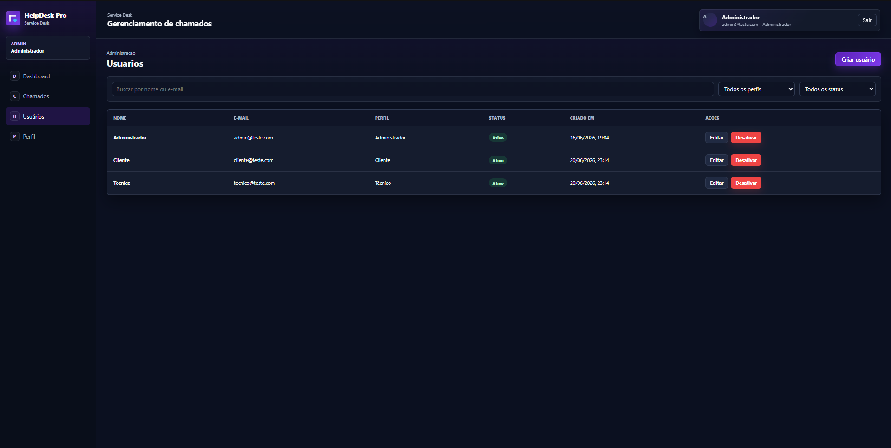
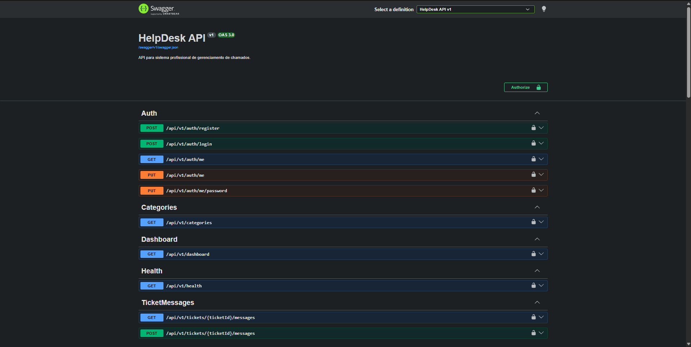

# 🎫 HelpDesk Pro

Sistema Full Stack de Gerenciamento de Chamados, desenvolvido para simular um ambiente real de Service Desk e Suporte Técnico.

O projeto possui autenticação JWT, controle de acesso por perfis, abertura e acompanhamento de chamados, conversa entre cliente e técnico, dashboard analítico e gerenciamento de usuários.

---

## 📸 Demonstração

Crie uma pasta chamada `screenshots` na raiz do projeto e coloque as imagens com estes nomes:

```text
screenshots/login.png
screenshots/dashboard.png
screenshots/tickets.png
screenshots/ticket-details.png
screenshots/users.png
screenshots/swagger.png
```

### Login



### Dashboard



### Chamados



### Detalhes do Chamado



### Gerenciamento de Usuários



### Swagger / API



---

## 🚀 Tecnologias Utilizadas

### Backend

* ASP.NET Core
* C#
* Entity Framework Core
* SQL Server
* PostgreSQL preparado para produção
* JWT Authentication
* BCrypt
* Swagger

### Frontend

* React
* Vite
* JavaScript
* Axios
* React Router DOM
* Recharts
* CSS

---

## ✨ Funcionalidades

### Autenticação

* Login com JWT
* Cadastro de usuário cliente
* Senhas criptografadas com BCrypt
* Rotas protegidas
* Controle de acesso por perfil

### Perfis

**Administrador**

* Dashboard completo
* Gerenciamento de usuários
* Visualização geral dos chamados

**Técnico**

* Visualização de chamados atribuídos
* Visualização de chamados sem técnico
* Assumir chamado
* Responder chamado
* Alterar status

**Cliente**

* Abrir chamado
* Acompanhar seus chamados
* Enviar mensagens
* Visualizar histórico

### Chamados

* Criação de chamados
* Listagem de chamados
* Filtros e busca
* Prioridade
* Status
* Atribuição de técnico
* Encerramento de chamado

### Conversa

* Mensagens dentro do chamado
* Atualização automática por polling
* Enter para enviar
* Shift + Enter para quebrar linha
* Histórico cronológico

### Dashboard

* Total de chamados
* Chamados abertos
* Chamados em andamento
* Chamados resolvidos
* Chamados por prioridade
* Chamados por status
* Chamados por técnico

---

## 🔑 Usuários de Teste

```text
Administrador
Email: admin@teste.com
Senha: 123456
```

```text
Técnico
Email: tecnico@teste.com
Senha: 123456
```

```text
Cliente
Email: cliente@teste.com
Senha: 123456
```

---

## 🏗️ Como Foi Construído

O projeto foi dividido em duas partes principais:

```text
Frontend React
        ↓
API REST ASP.NET Core
        ↓
Services
        ↓
Entity Framework Core
        ↓
Banco de Dados SQL Server
```

O backend foi estruturado com separação de responsabilidades, utilizando Controllers, Services, DTOs, Models, Middlewares e Responses.

O frontend foi organizado em páginas, componentes, rotas, serviços e estilos globais.

---

## 📂 Estrutura do Projeto

```text
HelpDesk-Pro
│
├── backend
│   └── HelpDesk.Api
│       ├── Controllers
│       ├── Data
│       ├── DTOs
│       ├── Enums
│       ├── Middlewares
│       ├── Models
│       ├── Responses
│       ├── Services
│       ├── Program.cs
│       └── appsettings.json
│
├── frontend
│   ├── src
│   │   ├── components
│   │   ├── contexts
│   │   ├── hooks
│   │   ├── pages
│   │   ├── routes
│   │   ├── services
│   │   ├── styles
│   │   ├── App.jsx
│   │   └── main.jsx
│   │
│   ├── package.json
│   └── vite.config.js
│
├── screenshots
└── README.md
```

---

## ⚙️ Como Baixar e Executar

### 1. Clonar o repositório

```bash
git clone https://github.com/PoxaPonto/NOME-DO-REPOSITORIO.git
```

```bash
cd NOME-DO-REPOSITORIO
```

---

## 🖥️ Backend

Entre na pasta da API:

```bash
cd backend/HelpDesk.Api
```

Restaure os pacotes:

```bash
dotnet restore
```

Aplique as migrations:

```bash
dotnet ef database update
```

Execute a API:

```bash
dotnet run
```

A API será iniciada em uma URL parecida com:

```text
http://localhost:5026
```

Swagger:

```text
http://localhost:5026/swagger
```

---

## 🌐 Frontend

Em outro terminal, entre na pasta do frontend:

```bash
cd frontend
```

Instale as dependências:

```bash
npm install
```

Execute o projeto:

```bash
npm run dev
```

O frontend será iniciado em:

```text
http://localhost:5173
```

---

## 🔧 Configuração Local

### Backend

O projeto local utiliza SQL Server LocalDB.

Exemplo de connection string:

```json
"ConnectionStrings": {
  "DefaultConnection": "Server=(localdb)\\MSSQLLocalDB;Database=HelpDeskDB;Trusted_Connection=True;TrustServerCertificate=True;"
}
```

### Frontend

O frontend usa a variável:

```env
VITE_API_BASE_URL=http://localhost:5026/api/v1
```

Crie um arquivo `.env` dentro da pasta `frontend` caso necessário.

---

## 📌 Endpoints Principais

```http
POST /api/v1/auth/register
POST /api/v1/auth/login
GET /api/v1/tickets
POST /api/v1/tickets
GET /api/v1/tickets/{id}
POST /api/v1/tickets/{id}/messages
GET /api/v1/dashboard
GET /api/v1/users
```

---

## 🎯 Objetivo do Projeto

Este projeto foi desenvolvido para praticar e demonstrar conhecimentos em:

* Desenvolvimento Full Stack
* APIs REST
* ASP.NET Core
* React
* Entity Framework Core
* Autenticação JWT
* Controle de acesso por perfis
* SQL Server
* Modelagem de banco de dados
* Integração Frontend e Backend
* Arquitetura em camadas

---

## 🚀 Possíveis Melhorias Futuras

* SignalR para mensagens em tempo real
* Upload de anexos
* Notificações por e-mail
* Relatórios avançados
* Exportação em PDF
* Deploy completo com Render e Vercel
* Testes automatizados

---

## 👨‍💻 Desenvolvedor

**Guilherme Cavalcante**

Full Stack Developer

GitHub:
https://github.com/PoxaPonto

LinkedIn:
https://www.linkedin.com/in/guilherme-cavalcante-109a8a363/
